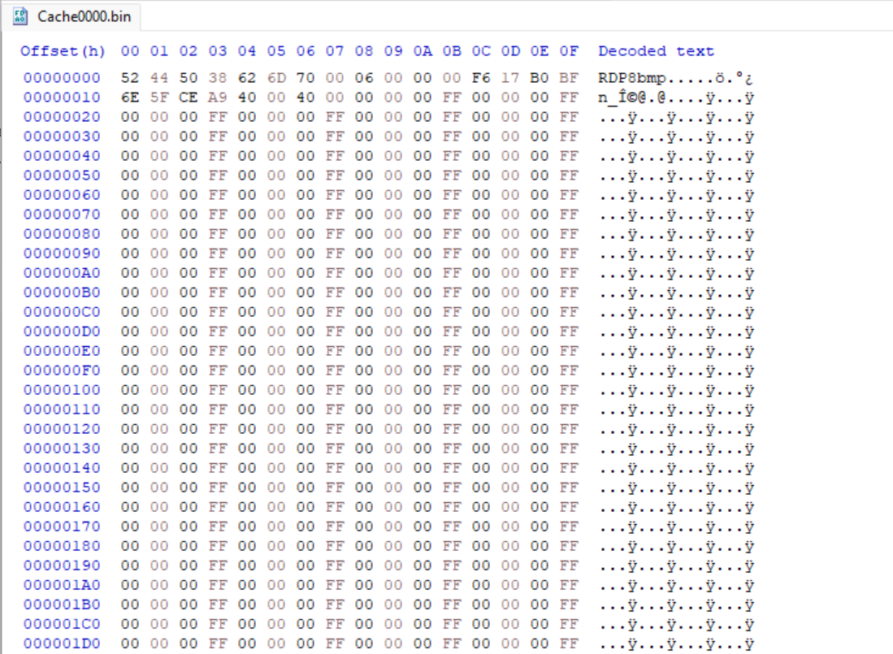

# Bits'nPieces 
>Somewhere in these digital fragments lies what you've been searching for your entire lifetime, or really just this weekend ;)
>
>
>
>SHA256: 4b52731748484ecaa9ba3a5c8ec455675c78d0e3f8ac349a2a54e5e1f0cbb2a1

## Solution
in this challenge we are given bin file.
Looking at the bin file in a hex editor, we can notice this is RDP8bmp file is RDP bitmap cache. 

so  we can use [mbc-tools](https://github.com/ANSSI-FR/bmc-tools) to extract bmp file, using option -b to combine all bmp file

```
python3 bmc-tools.py -s Cache0000.bin -d . -b
```
after That we Open the Cache0000.bin_collage.bmp and we can found the flag in picture

## Flag
```
CIT{c4ch3_m3_if_y0u_c4n}
```

