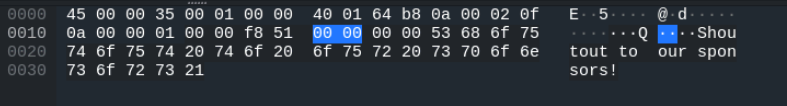
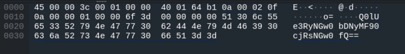

## Brainrot Quiz!

Bombardiro Crocodillo or....? You find out...

SHA256: e5f5d4e97506233266904e460fdfea4fc3ce2bf1542dc122283835c545fb8516


## Solution

Opening up the file in Wireshark and looking through the packets, I see this data in packet 7.



This leads me to believe that the flag will be in the data of a packet. Continuing my search, I find what looks like a base64 encrypted string in the data of packet 11



```
Q0lUe3RyNGw0bDNyMF90cjRsNGw0fQ==
```

Decoding this string gives you the flag.

FLAG: `CIT{tr4l4l3r0_tr4l4l4}`
