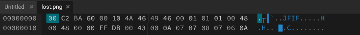

## We lost the flag
Sorry everyone, we unfortunately lost the flag for this challenge.

SHA256: d1058ed414e6e45f4d2c7cc41baf73b3778a80be18cdf2d6470348c72ab01dfd

## Solution

The given png file is corrupted. This suggests that there is an issue with the headers. Opening up the file in hexed.it, you see this:

 

 Looking up the magic numbers for jpeg (jfif) files, I find that it is `FF D8 FF E0 00 10 4A 46
49 46 00 01`. This should be the starting of the hex in this file, but it is not. Correcting this error, and saving the new flag, then opening the image allows you to view the flag. 

FLAG: `CIT{us1ng_m4gic_1t_s33m5}`

