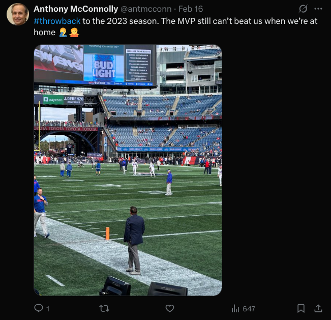

## Throwback to the Future

What date was Anthony McConnolly's "throwback" photo taken? (not the day it was posted)

Format: MM/DD/YYYY

## Solution

Using the username we found from GitHub, we find a [Twitter](https://x.com/antmcconn) page for Anthony McConnolly. For this challenge, we are looking at this specific post:

Looking closely at the picture, we can see a person wearing a `Buffalo Bills` shirt. So, we are looking for a 2023 football game Bills v. team, in which the mvp could not beat the home team. The 2023 MVP was `Josh Allen`. A reverse image search on the picture brings up the `Gillette Stadium` which is home to the New England Patriots.

A quick Google search confirms that this match took place on 10/22/2023 (found at wikepedia). 

Flag: `10/22/2023`
