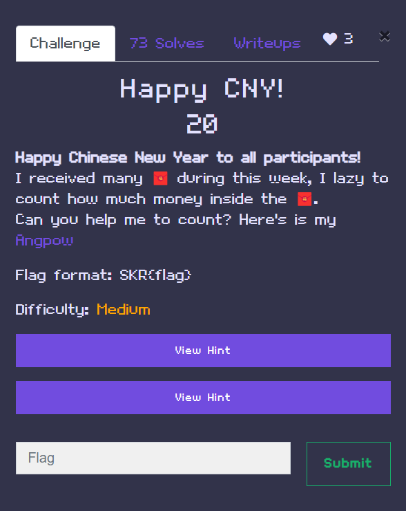

# 🎁 Angpow  CTF Challenge Write-Up
<p align="center">
  
</p>

## 📖 Challenge Description

Happy Chinese New Year to all participants!
I received many 🧧 during this week, I lazy to count how much money inside the 🧧.
Can you help me to count? Here's is my Angpow

## **SOLUTION**  
in this challenge we are given 41 folder that contain picture of money. As Hint clue to ASCII so i think we need to count the money in each angpow 

## 🧩 Clue
while doing the counting i found something interesting.
I discovered that only specific image sizes translated to money values, according to this mapping:

| Image Size (KB) | Angpow Value (RM) |
|-----------------|-------------------|
| 120             | RM50              |
| 108             | RM20              |
| 113             | RM10              |
| 130             | RM1               |
| 123             | RM5               |


## 🛠️ The Script
SO to ease doing the counting I wrote the python script
- Traverse each `AngpowX` folder
- Read the size of each image
- Match the size to the corresponding RM value
- Calculate the **total RM value per folder**

Here's the script.

```python
import os
import math

base_path = r"C:\Angpows"

size_to_rm = {
    120: 50,
    108: 20,
    113: 10,
    130: 1,
    123: 5
}

def get_image_size_in_kb(image_path):
    if os.path.isfile(image_path):
        size_bytes = os.path.getsize(image_path)
        size_kb = size_bytes / 1024
        return math.ceil(size_kb)
    return None

for i in range(1, 41):
    folder_name = f"Angpow{i}"
    folder_path = os.path.join(base_path, folder_name)
    total_money = 0

    for j in range(1, 5):
        image_name = f"{j}.jpg"
        image_path = os.path.join(folder_path, image_name)

        size_kb = get_image_size_in_kb(image_path)
        if size_kb is not None:
            rm_value = size_to_rm.get(size_kb)
            if rm_value:
                total_money += rm_value

       print(f"{total_money}",end=' ')
#output =83 75 82 123 71 48 78 71 95 88 73 95 72 85 52 84 95 67 72 48 49 95 88 73 78 95 78 73 52 78 95 75 85 52 73 95 76 51 33 125
```


## 💰 Final Output
So we get the final otput in decimal so we need to decode it and we get the flag hohohohoh


