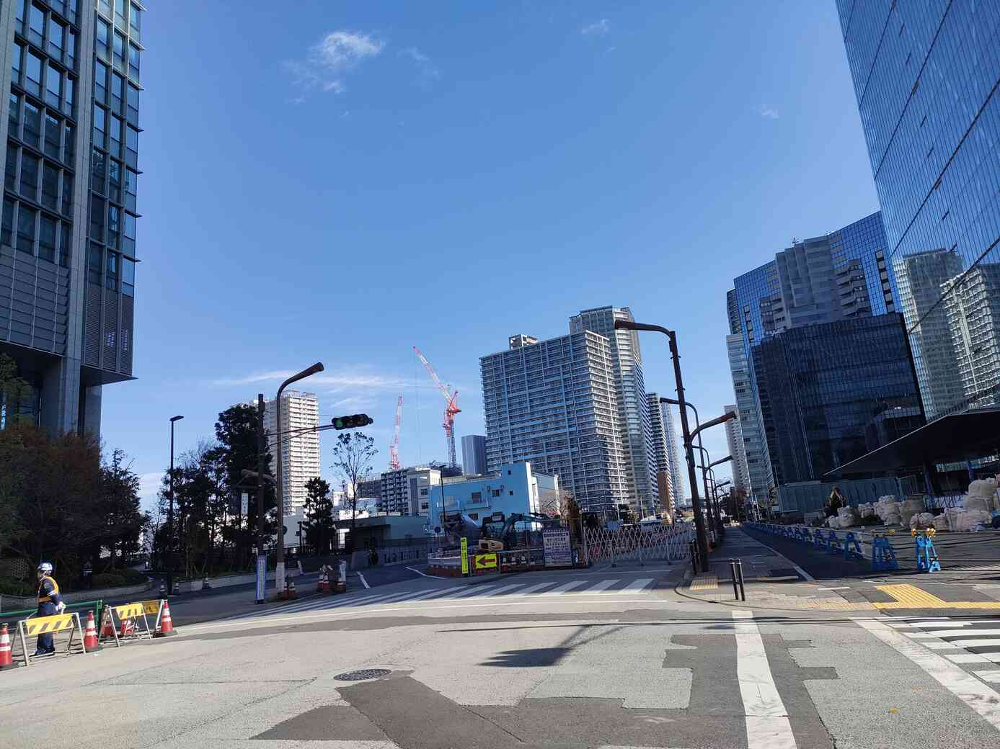

<p align="center">
  
</p>


>あの建物が建ったら、また空が狭くなるんだろうな。
>フラグフォーマットはこの人が立っている場所のTsukuCTF25{緯度_経度}です。ただ
>し、緯度および経度は小数点以下五桁目を切り捨てたものとします。


## Translation:
Once that building is built, the sky will probably get narrower again.

The flag format is TsukuCTF25{latitude_longitude} of the location where this person is standing. Note that the latitude and longitude are rounded down to five decimal places.

## Solution:

Used Google lens on the image. It provided me with two bulding names - Global Front tower and ロイヤルパークス品川 (Royal Parks Shinagawa). They are both from same place that is - Minato City, Tokyo, Japan.

Using Google Maps searched for the places. Found the buildings that resembles those in the image. As the photo is taken on a road, I followed the road and observed the buildings to position them just like how the image looks. I got to the position where the photo was taken as everything matches perfectly. Got the coordinated, rounded them.

I got the flag!
## Flag:
```
 TsukuCTF25{35.6318_139.7431}
```
