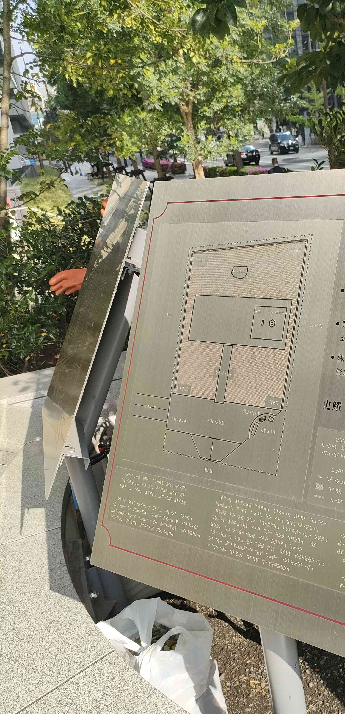

<p align="center">
  
</p>


>力を感じてきた。
>フラグフォーマットはこの人が立っている場所のTsukuCTF25{緯度_経度}です。ただ
>し、緯度および経度は小数点以下五桁目を切り捨てたものとします。

## Translation:

I’ve felt the power.

The flag format is TsukuCTF25{latitude_longitude} of the location where this person is standing. Note that the latitude and longitude are rounded down to five decimal places.

## Solution :

Looking at the image, it is tactile map of someplace in Japan( as the image contains a japanese character). It contains a braille etched metal plate.

Used Google lens on the image, I searched the image by cropping it various ways after I cropped it full and added “Japan” to the search, looking over the results, I found the image which resembles the photo. The image is from a stockphoto website. After reading the description, it seems that the image is of “Taira no Masakado’s Grave”

Using google maps went over to the location, looked for the maps, found them. Got the coordinated, rounded them.

I got the flag!

## Flag:
```
 TsukuCTF25{35.6872_139.7628}
```
