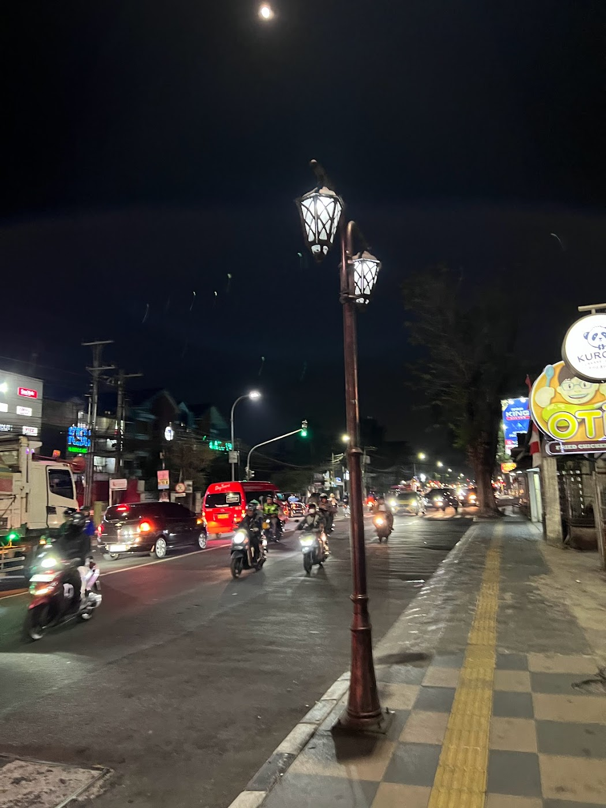

<p align="center">
  
</p>


>遠くまで歩き、夕闇に消える足跡
>煌めく街頭が、夜の街を飾る
>傍らの道には、バイクの群れが過ぎ去り
>風の音だけが残る
>
>光と影の中、ふと立ち止まり思う
>私は今、どこにいるんだろう
>
>フラグフォーマットはこの人が立っている場所のTsukuCTF25{緯度_経度}です。ただ
>し、緯度および経度は小数点以下五桁目を切り捨てたものとします。


## Translation:
Footprints that walk far away and disappear into the evening darkness, The glittering streetlights decorate the city at night, A group of motorbikes pass by on the road nearby, Only the sound of the wind remains, In the light and shadow, I suddenly stop and wonder, Where am I now?

The flag format is TsukuCTF25{latitude_longitude} of the location where this person is standing. However, the latitude and longitude are rounded down to the fifth decimal place.

_View Hint: This poem has no meaning.__

## Solution:

After looking at the image and using google lens, found some restaurant named “OTI fried chicken 🍗“ which is a restaurant chain in Indonesia .

Using google maps and the restaurant’s official webpage, I looked over its branches. After looking at some of the branches came across a branch which has a panda logo on the side of it and the same street light from that in the image. Got the coordinated, rounded them.

I got the flag!
```
TsukuCTF25{-7.3189_110.4970}
```
